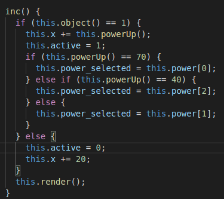

## dsi-p5-mkart-alu0100658705

## Pablo Bethencourt Díaz

## alu0100658705@ull.edu.es

### Práctica 5: M. Kart

1. **La carrera debería tener un botón Start que comenzará la carrera hasta que uno de los Karts llegue a la meta (condición para terminar la carrera). Dicha condición podría ser cuando x sea 950:**

Para empezar, se ha mantenido la estructura original de la práctica expuesta en los videos, así en el archivo _index.css_ y el _index.js_ solo se han realizado cambios puntuales.

Dentro del fichero que contiene el componente, se ha implementado un método _isWinner_ que determina cuando el Kart ha llegado a la meta, deteniendo la carrera:

En caso de ser ganador, ese Kart en concreto llamará al metono _win()_ que le dará un tamaño al borde, mostrando su silueta en relieve dorado. En caso de perder, se llama al método _lose()_ que aplica una opcacidad de 0.5 a la imagen.

Si se quiere resetear la carrera, se hace uso del método _restart()_:

2. **Sería recomendable utilizar ShadowDOM para encapsular el HTML y CSS del componente y no afecte a otros karts.**

Se ha empleado el ejemplo expuesto en la práctica, añadiendo alguna funcionalidad o estilo nuevos:

Se define un nuevo elemento imagen, con sus propias características, que define el item que recibe el Kart. Empezará siendo transparente, y cuando comience la carrera, se mostrará cargando la imagen correspondiente en caso de que el Kart obtenga un item. Las imagenes de los items se obtienen con un import, tal y como se hiciese para las imágenes de los karts en _index.js_, se añaden a un array que las y se "invoca" a la correspondiente cuando sea necesario. Para ello se hace uso de los siguientes métodos:

3. **Sería interesante crear métodos de ayuda para el componente, que afecten al propio kart.**

Además de los métodos ya vistos, se han implementado también los siguientes:

El método _inc()_ realiza el desplazamiento del Kart. Como se ha explicado anteriormente, el desplazamiento puedo venir definido en función de si el Kart recibe un item y, en caso de hacerlo, cuál es el que recibe. Para ello se llaman a dos nuevos:

- _object()_ : Determina si recibe item o no.
- _powerUp()_ : Determina que objeto se recibe.

### Retos

**Como reto opcional, se puede añadir la posiblidad aleatoria (Math.random()) de que en cada iteración, un kart obtenga un item. Si obtiene un plátano, la velocidad desciende a cero temporalmente, manteniendo el kart en el mismo sitio al resbalar con el plátano. Si obtiene un champiñón, la velocidad asciende temporalmente, haciendo que vaya más rápido durante un tiempo.**

Aplicado: tres items (champiñones) que definen cuanto se debe de mover el kart o si se queda parado, en este caso el champiñon verde incrementa bastante su velocidad, el rojo la incrementa moderadamente y el violeta hace que se detenga.
